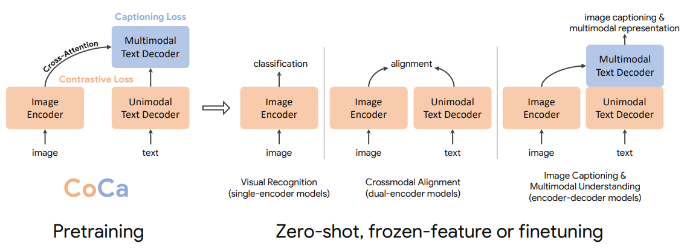
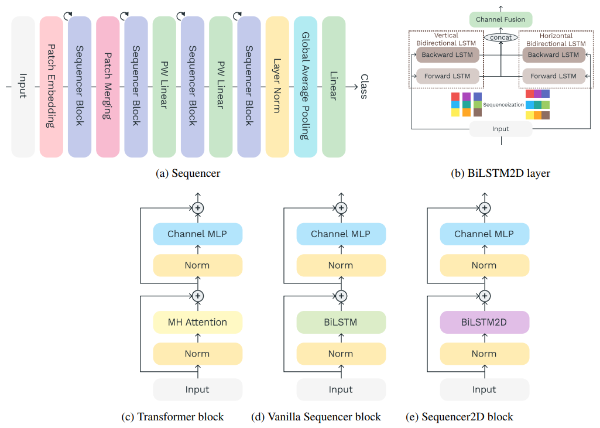
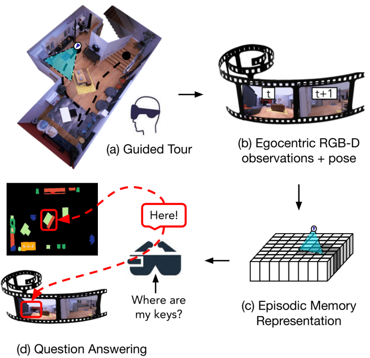
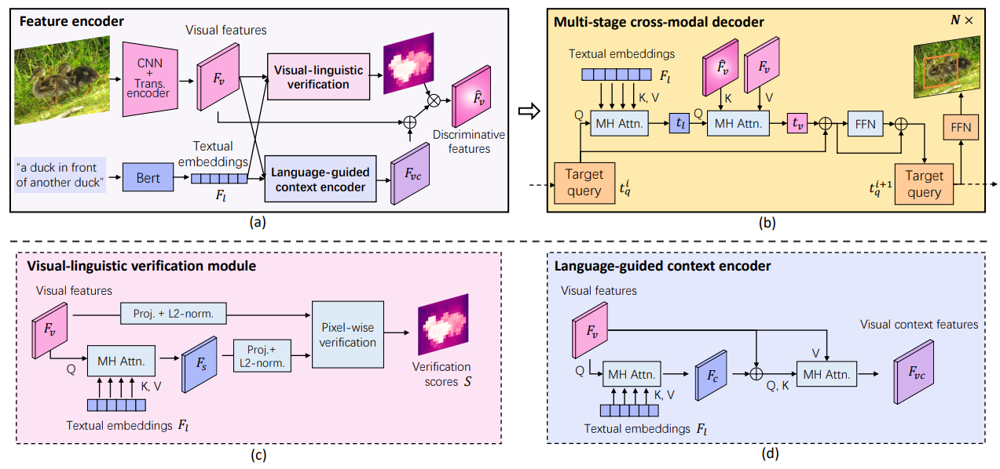
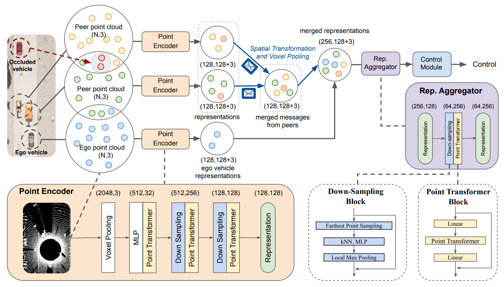
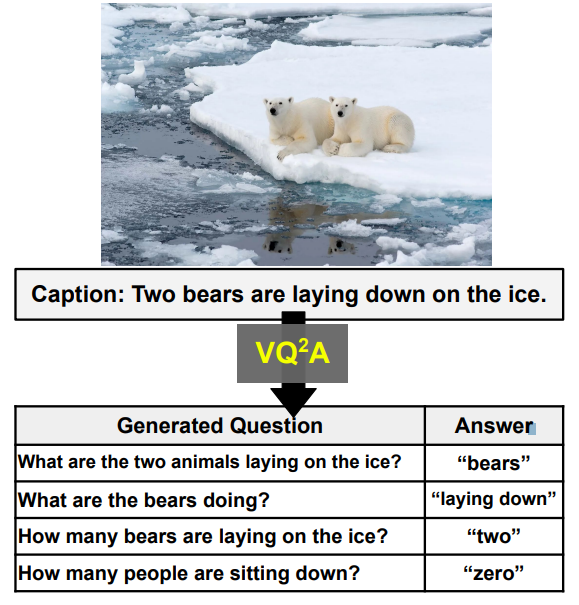

# Daily Paper Reading Log

## Table of Contents

- [2022](#2022)
    - [2022/05](#202205)   

## 2022
### 2022/05

- **2022/05/06, Friday.**

    1.<u>CoCa: Contrastive Captioners are Image-TextFoundation Models.</u> [[PDF]](https://arxiv.org/pdf/2205.01917.pdf)  
    - Main Idea: unify the single-encoder, dual-encoder and encoder-decoder paradigms with a caption head on top of CLIP-style architecture(dual-encoder). Pretraining the model with contrastive and caption loss.  
    - Experiments: CoCa obtains 86.3% *zero-shot* top-1 accuracy on ImageNet-1K, crazy, data is all you need!!!
    
  

    
    2.<u>Sequencer: Deep LSTM for Image Classification.</u> [[PDF]](https://arxiv.org/pdf/2205.01972.pdf)
    - Main Idea: Sequencer uses LSTM to model long-range depandencies. 
    - Experiments: Sequencer2D-L, with 54M parameters, realizes 84.6% top-1 accuracy on ImageNet-1K.
    - Take away message: inference is quite slow, more robust to resolution change.
    
  
  

    3.<u>Video Extrapolation in Space and Time.</u> [[PDF]](https://arxiv.org/pdf/2205.02084.pdf) [[Website]](https://cs.stanford.edu/~yzzhang/projects/vest/)
    - Main Idea: unify the novel view synthesis and video prediction tasks into a "Video Extrapolation in Space and Time" framework.
    - Take away message: joint training with relevant tasks might improve the performance on all tasks.
    
  
 
  
- **2022/05/07, Saturday.**

    1.<u> **Episodic Memory Question Answering. CVPR 2022, Oral**.</u> [[PDF]](https://arxiv.org/pdf/2205.01652.pdf)  [[Website]](https://samyak-268.github.io/emqa/)
    - Main Idea: answer the question by grounding the target in a egocentric video.
    - Take away message: a new task - Episodic Memory Question Answering (EMQA).
    
  

- **2022/05/08, Sunday.**

    1.<u> Improving Visual Grounding with Visual-Linguistic Verification and Iterative Reasoning. CVPR 2022.</u> Yang, Li, et al. CAS.  [[PDF]](https://arxiv.org/pdf/2205.00272.pdf)  [[Code]](https://github.com/yangli18/VLTVG)
    - Main Idea: better multi-modal fusion strategy with pixel-wise correlation and multi-stage cross-modal decoder.
    - Take away message: fusion is very important for multi-modal learning.
    
  

    2.<u> COOPERNAUT: End-to-End Driving with Cooperative Perception for Networked Vehicles. CVPR 2022.</u> Cui, Jiaxun, et al. The University of Texas at Austin.  [[PDF]](https://arxiv.org/pdf/2205.02222.pdf)  [[Code]](https://github.com/UT-Austin-RPL/Coopernaut) [[Website]](https://ut-austin-rpl.github.io/Coopernaut/)
    - Main Idea: incorporate the visual information (point-cloud) from other vehicles to improve the success rate in challenging driving situations.
    - Experiments: 40% improvement in average success rate over egocentric driving models in these challenging driving situations.
    - Take away message: a interesting task.
    
  

    3.<u> Language Models Can See: Plugging Visual Controls in Text Generation. Submit to NeurIPS 2022.</u> Sun, Yixuan, et al. University of Cambridge. [[PDF]](https://arxiv.org/pdf/2205.02655.pdf) [[Code]](https://github.com/yxuansu/MAGIC)
    - Main Idea: combines an off-the-shelf LM (i.e., GPT-2) and an image-text matching model (i.e., CLIP) for image-grounded text generation.
    - Take away message: previous works mainly use CLIP to generate images with the guide of provided language, this work uses CLIP in a opposite way.
    
  

    4.<u> All You May Need for VQA are Image Captions.</u>  Changpinyo, Soravit, et al. Google. [[PDF]](https://arxiv.org/pdf/2205.01883.pdf)
    - Main Idea: generate questions from the image caption.
    - Take away message: none.
    
  

    

Pending...

