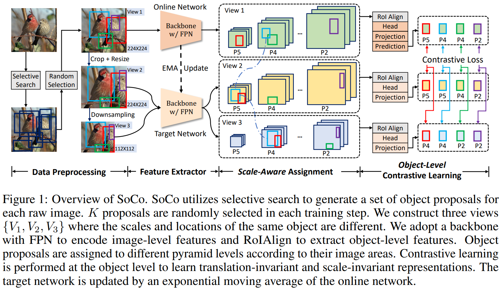
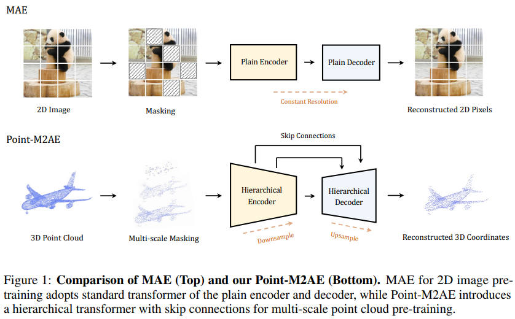

# Daily Paper Reading Log

## Table of Contents

- [2022](#2022)
    - [2022/05](#2022/05/202205)   
    - [2022/06](#2022/06/202206)  

## 2022
### 2022/05: Read 36 papers.

- **2022/05/06, Friday.**

    1. <u>CoCa: Contrastive Captioners are Image-TextFoundation Models.</u> [[PDF]](https://arxiv.org/pdf/2205.01917.pdf)  
    - Main Idea: unify the single-encoder, dual-encoder and encoder-decoder paradigms with a caption head on top of CLIP-style architecture(dual-encoder). Pretraining the model with contrastive and caption loss.  
    - Experiments: CoCa obtains 86.3% *zero-shot* top-1 accuracy on ImageNet-1K, crazy, data is all you need!!!
    
  

    
    2. <u>Sequencer: Deep LSTM for Image Classification.</u> [[PDF]](https://arxiv.org/pdf/2205.01972.pdf)
    - Main Idea: Sequencer uses LSTM to model long-range depandencies. 
    - Experiments: Sequencer2D-L, with 54M parameters, realizes 84.6% top-1 accuracy on ImageNet-1K.
    - Take away message: inference is quite slow, more robust to resolution change.
    
  
  

    3. <u>Video Extrapolation in Space and Time.</u> [[PDF]](https://arxiv.org/pdf/2205.02084.pdf) [[Website]](https://cs.stanford.edu/~yzzhang/projects/vest/)
    - Main Idea: unify the novel view synthesis and video prediction tasks into a "Video Extrapolation in Space and Time" framework.
    - Take away message: joint training with relevant tasks might improve the performance on all tasks.
    
  
 
  
- **2022/05/07, Saturday.**

    4. <u> **Episodic Memory Question Answering. CVPR 2022, Oral**.</u> [[PDF]](https://arxiv.org/pdf/2205.01652.pdf)  [[Website]](https://samyak-268.github.io/emqa/)
    - Main Idea: answer the question by grounding the target in a egocentric video.
    - Take away message: a new task - Episodic Memory Question Answering (EMQA).
    
  

- **2022/05/08, Sunday.**

    5. <u> Improving Visual Grounding with Visual-Linguistic Verification and Iterative Reasoning. CVPR 2022.</u> Yang, Li, et al. CAS. [[PDF]](https://arxiv.org/pdf/2205.00272.pdf) [[Code]](https://github.com/yangli18/VLTVG)
    - Main Idea: better multi-modal fusion strategy with pixel-wise correlation and multi-stage cross-modal decoder.
    - Take away message: fusion is very important for multi-modal learning.
    
  

    6. <u> COOPERNAUT: End-to-End Driving with Cooperative Perception for Networked Vehicles. CVPR 2022.</u> Cui, Jiaxun, et al. The University of Texas at Austin. [[PDF]](https://arxiv.org/pdf/2205.02222.pdf) [[Code]](https://github.com/UT-Austin-RPL/Coopernaut) [[Website]](https://ut-austin-rpl.github.io/Coopernaut/)
    - Main Idea: incorporate the visual information (point-cloud) from other vehicles to improve the success rate in challenging driving situations.
    - Experiments: 40% improvement in average success rate over egocentric driving models in these challenging driving situations.
    - Take away message: a interesting task.
    
  

    7. <u> Language Models Can See: Plugging Visual Controls in Text Generation. Submit to NeurIPS 2022.</u> Sun, Yixuan, et al. University of Cambridge. [[PDF]](https://arxiv.org/pdf/2205.02655.pdf) [[Code]](https://github.com/yxuansu/MAGIC)
    - Main Idea: combines an off-the-shelf LM (i.e., GPT-2) and an image-text matching model (i.e., CLIP) for image-grounded text generation.
    - Take away message: previous works mainly use CLIP to generate images with the guide of provided language, this work uses CLIP in a opposite way.
    
  

    8. <u> All You May Need for VQA are Image Captions.</u>  Changpinyo, Soravit, et al. Google. [[PDF]](https://arxiv.org/pdf/2205.01883.pdf)
    - Main Idea: generate questions from the image caption.
    - Take away message: none.
    
  

    
- **2022/05/09, Monday.**

    9. <u> Inferring and Executing Programs for Visual Reasoning. ICCV 2017.</u> Johnson, Justin, et al. UC Berkeley. [[PDF]](https://arxiv.org/pdf/1705.03633.pdf) [[Code]](https://github.com/yangli18/VLTVG)
    - Main Idea: Specialize neural modules to execute different kind visual reasoning.
    
  

- **2022/05/10, Tuesday.**

    10. <u> SwapMix: Diagnosing and Regularizing the Over-Reliance on Visual Context in Visual Question Answering. CVPR 2022.</u> Gupta, Vipul, et al. U Penn. [[PDF]](https://arxiv.org/pdf/2204.02285.pdf) [[Code]](https://github.com/vipulgupta1011/swapmix)
    - Main Idea: Investigate the over-reliance on unrelate visual content for VQA models. 
    - Methods: Replace the unrelated visual content with similar objects and test the performance of VQA models. Also, the replacing can also be applied as a data augmentation which boost the robustness of VQA models.
    - Take away message: the robustness of multi-modal models can be impacted by visual content.
    
  

    11. <u> Words Aren’t Enough, Their Order Matters: On the Robustness of Grounding Visual Referring Expressions. ACL 2020.</u> Walmer, Matthew, et al. U Maryland. [[PDF]](https://arxiv.org/pdf/2112.07668.pdf) [[Code]](https://github.com/SRI-CSL/TrinityMultimodalTrojAI)
    - Main Idea: models do not change their answer when the order of words in a sentence changed.
    
    12. <u> Visual Spatial Reasoning. arXiv 2022/4/30.</u> Liu, Fangyu, et al. U Cambridge. [[PDF]](https://arxiv.org/pdf/2205.00363.pdf) [[Code]](https://github.com/cambridgeltl/visual-spatial-reasoning)
    - Main Idea: Build a 2D visual spatial reasoning(VSR) dataset to investigate the visual spatial reasoning ability of VL models. 
    - Dataset details:
        - 65 spatial relations and has more than 10k(10,119) data points, using 6940 image from MSCOCO.
    - Take away message: 
        - positional encodings are extremely important for VSR task.
        - models' by-relation performance barely correlates with the number of training examples.
        - a large gap between human and model performance (human ceiling on the VSR task is above 95% and models only achieve around 70%).

    13. <u> **Dual-Key Multimodal Backdoors for Visual Question Answering. CVPR 2022**.</u> Walmer, Matthew, et al. U Maryland. [[PDF]](https://arxiv.org/pdf/2112.07668.pdf) [[Code]](https://github.com/SRI-CSL/TrinityMultimodalTrojAI)
    - Main Idea: Training the VQA models with multimodal backdoors. The backdoor will only be activated when triggers in both modalities are present. 
    - Take away message: TrojVQA is a large collection of clean and trojan VQA models to enable research in defending against multimodal backdoors.
    
  

- **2022/05/14, Saturday.**

    14. <u> Making Better Mistakes: Leveraging Class Hierarchies with Deep Networks.</u> Bertinetto, Luca, et al. Five AI. [[PDF]](https://openaccess.thecvf.com/content_CVPR_2020/papers/Bertinetto_Making_Better_Mistakes_Leveraging_Class_Hierarchies_With_Deep_Networks_CVPR_2020_paper.pdf) [[Code]](https://github.com/fiveai/making-better-mistakes)
    - Main Idea: Leveraging class hierarchies to make better mistakes on image classification.
    - Take away message: Although top-1 acc is improving, the severity(stupidity) of mistake is fairly unchanged.

- **2022/05/15 - 2022/05/20, Rushing NeurIPS.**

- **2022/05/21, Saturday.**

    15. <u> **Open-Vocabulary Object Detection Using Captions. CVPR 2021 Oral**.</u> Zareian, Alireza, et al. U Columbia. [[PDF]](https://arxiv.org/pdf/2011.10678.pdf) [[Code]](https://github.com/alirezazareian/ovr-cnn)
    - Main Idea: Pre-train the visual backbone with image-text pairs which is easy to access from web to learn the visual semantics about diverse classes(include classes which do not have box annotation). 
    
  

    16. <u> ScanQA: 3D Question Answering for Spatial Scene Understanding. CVPR 2022.</u> Azuma Daichi, Alireza, et al. U Columbia. [[PDF]](https://arxiv.org/pdf/2112.10482.pdf) [[Code]](https://github.com/ATR-DBI/ScanQA)
    - Main Idea: Introduce a 3D-QA dataset with question-answer pair and correspoinding box annotations.
    - Limitation: The annotations are derived from the ScanNet dataset using question generation models.
    - Notes:
        - Surprisingly, the randomimage+2D-QA models performs quite well.
    - Take away message: Object classification and localization both help the question-answering task.
    
  

- **2022/05/22, Sunday.**

    17. <u> Bottom-Up and Top-Down Attention for Image Captioning
    and Visual Question Answering. CVPR 2018 Oral.</u> Yu, Zhou, et al. Hangzhou Dianzi U. [[PDF]](https://arxiv.org/pdf/1707.07998.pdf) [[Code]](https://github.com/peteanderson80/bottom-up-attention)
    - Main Idea: Bottom-up attention with top-down attention. Bottom-up means purely visual feed-forward attention mechanisms. Top-down means task-specific attention, *e.g.*, given a query "looking for ball".
    - Method: Implementing the bottom-up attention by pre-training a FasterRCNN on Visual Genome dataset. The top-down attention is specifically designed for different tasks.
    - Notes: This a common strategy.

    18. <u> D3Net: A Speaker-Listener Architecture for Semi-supervised Dense Captioning and Visual Grounding in RGB-D Scans. arXiv 2021/12/2.</u> Chen, Zhenyu, et al. [[PDF]](https://arxiv.org/pdf/2112.01551.pdf) [[Code]](https://github.com/daveredrum/D3Net)
    - Main Idea: Design a speaker-listener architecture, speaker have to generate discriminative descriptions so that listener can better localize the described targets.
    - Method: Training by reinforce algorithm.
    - Take away message: Fine-tuning a 3D detector is essential to get good performance.
    
  

    19. <u> Declaration-based Prompt Tuning for Visual Question Answering. IJCAI 2022.</u> Liu, Yuhang, et al. Huazhong University of Science and Technology. [[PDF]](https://arxiv.org/pdf/2205.02456.pdf) [[Code]](https://github.com/CCIIPLab/DPT)
    - Main Idea: Reformulate the VQA training objective to MLM and ITM, and then transform the question to a declaration type which both close the gap between the pre-training and fine-tuning.
    - Method: Training by reinforce algorithm.
    - Take away message: Similar objectives used in fine-tuning will help to transfer the knowledge learned in pre-training.
    
  

    20. <u> Answer-Me: Multi-Task Open-Vocabulary Visual Question Answering. arXiv 2022/5/2.</u> Piergiovanni, AJ, et al. Google Research. [[PDF]](https://arxiv.org/pdf/2205.00949.pdf) [Code Not Found]
    - Main Idea: Design a multi-task task-aware general framework which is able to deal with open-vocabulary VQA.
    - Method: Pre-train with a encoder-decoder architecture.
    - Take away message: semantically related tasks benefit from multi-task training as visual linguistic concepts are shared, helping their co-training.
    
  

    21. <u> Rethinking Diversified and Discriminative Proposal Generation for Visual Grounding. IJCAI 2018.</u> Yu, Zhou, et al. Hangzhou Dianzi U. [[PDF]](https://arxiv.org/pdf/1805.03508.pdf) [[Code]](https://github.com/XiangChenchao/DDPN)
    - Main Idea: Generated proposals should be diversified and discriminative simultaneously: 1) the proposals of all images should be diversified to detect objects from open-vocabulary classes, and 2) the proposals of an individual image should be discriminative to guarantee that the proposals and visual features accurately represent the true semantic.
    - Method: Pretraining the object detector on Visual Genome dataset, emmmm.
    - Limitation: The story is attractive, however, the method is really have nothing to say.
    - Take away message: Soft label help the performance a lot, as show in Table 2.

- **2022/05/23, Monday.**

    22. <u> Weakly Supervised Relative Spatial Reasoning for Visual Question Answering. ICCV 2021.</u> Banerjee, Pratyay, et al. Arizona State University. [[PDF]](https://arxiv.org/pdf/2109.01934.pdf) [[Code]](https://github.com/pratyay-banerjee/weak_sup_vqa)
    - Main Idea: Incoporating the object centroid estimation(OCE) and relative position estimation(RPE) task with 2D Visual Question Answering task to enhance the spatial reasoning ability of visual model.
    - Take away message: Formulating the OCE and RPE as regression task will fail. In contrast, formulating them as bin-classification task will success!
    
  

- **2022/05/24, Tuesday.** 

    23. <u> Probing the Role of Positional Information in Vision-Language Models. ACL submission 2022/01.</u> Anonymous. [[PDF]](https://openreviewnet/pdf?id=2Ubik08ztdB) [Code Not Found]
    - Main Idea: Probing the role of positional information in a unimodal way and a cross-modal way.
    - Take away message: 
        - current vision-language pre-training strategies fail to align the visual positional information with textual positional information.
        - replace the positional word in text with its counterpart(*e.g.*, left/right) and pre-train models to distinguish the text. 
        - object center is enough for representing the positional information for a object.

    24. <u> Things not Written in Text: Exploring Spatial Commonsense from Visual Signals. ACL 2022.</u> Liu, Xiao, et al. [[PDF]](https://aclanthology.org/2022.acl-long.168.pdf) [[Code]](https://github.com/xxxiaol/spatial-commonsense)
    - Take away message: 
        - spatial reasoning includes objects' scale, relative position between objects.
        - many works found that PLMs lack of spatial reasoning ability.
    
    25. <u> X-Trans2Cap: Cross-Modal Knowledge Transfer using Transformer for 3D Dense Captioning. CVPR 2022.</u> Yuan, Zhihao, et al. [[PDF]](https://arxiv.org/pdf/2203.00843.pdf) [[Code]](https://github.com/CurryYuan/X-Trans2Cap)
    - Main Idea: Incoporating 2D images into 3D dense caption task. To avoid using 2D modality in inference stage, authors propose to build a 3D single-modal model by distilling knowledge from a 2D-3D multi-modal network
    
  

    26. <u> Pri3D: Can 3D Priors Help 2D Representation Learning?. ICCV 2021.</u> Hou, Ji, et al. [[PDF]](https://arxiv.org/pdf/2104.11225.pdf) [[Code]](https://github.com/Sekunde/Pri3D)
    - Main Idea: Pre-training with 3D point cloud data to help 2D tasks.
    - Method: View-invariant contrastive loss between 2D images and geometric prior contrastive loss between 2D and 3D.
    
  

- **2022/05/25, Wednesday.** 

    27. <u> Learning from 2D: Contrastive Pixel-to-Point Knowledge Transfer for 3D Pretraining (2D help 3D). arXiv 2021/04.</u> Liu, Yueh-Cheng, et al. National Taiwan University. [[PDF]](https://arxiv.org/pdf/2104.04687.pdf) [Code Not Found]
    - Main Idea: Pre-training with 2D images for 3D point cloud to help the 3D tasks.
    - Method: Contrast between point and pixel directly.
    
  

    28. <u> Self-Supervised Image Representation Learning with Geometric Set Consistency (3D help 2D). CVPR 2022.</u> Chen, Nenglun, et al. The University of Hong Kong. [[PDF]](https://arxiv.org/pdf/2203.15361.pdf) [Code Not Found]
    - Main Idea: The semantic cues lie in the discontinuities or depth gaps in 3D point cloud.
    - Method: 
        - Cluster the 3D point cloud into many local small segments, (geometric consistency sets). 
        - Propose a Set-InfoNCE loss to perform contrastive learning between point cloud geometric consistency set and images.
        - First, pre-training the model with Pri3D strategy. And then train it with proposed method.
    - Take away message: The gain comes from the semantic segmentation of 3D point cloud scene with a conventional method.
    
  

    29. <u> Image-to-Lidar Self-Supervised Distillation for Autonomous Driving Data (2D help 3D). CVPR 2022.</u> Sautier, Corentin, et al. valeo.ai, Paris, France. [[PDF]](https://arxiv.org/pdf/2203.16258.pdf) [[Code]](https://github.com/valeoai/SLidR)
    - Main Idea: Similar to No.28, conduct contrastive learning between visually similar regions.
    - Method: 
    - Take away message: The design 2D projection head matters a lot. Stacking multiple convolution layers with kernel size larger than 1 will fail due to the leak of contextual information. 
    
  

- **2022/05/26, Thursday.** 

    30. <u> SimIPU: Simple 2D Image and 3D Point Cloud Unsupervised Pre-Training for Spatial-Aware Visual Representations (2D help 3D). AAAI 2022.</u> Li, Zhenyu, et al. HIT. [[PDF]](https://arxiv.org/pdf/2112.04680.pdf) [[Code]](https://github.com/zhyever/SimIPU)
    - Main Idea: 2D and 3D pre-training for outdoor lidar(point cloud data).
    - Method: 
        - Intra-modal(lidar) learning is performed by contrasting different views' features.  Use global feature other than local feature due to outdoor data is much more noise and massive.
        - Inter-modal(lidar-2D) learning is conducted by contrast paired 2D-3D features.
    - Take away message: Change the application domain of 2D-3D pre-training. Not interesting.
    
  

    31. <u> P4Contrast: Contrastive Learning with Pairs of Point-Pixel Pairs for RGB-D Scene Understanding (2D help 3D). arXiv 2020/12.</u> Li, Zhenyu, et al. Xidian University. [[PDF]](https://arxiv.org/pdf/2012.13089.pdf) [Code Not Found]
    - Main Idea: Point-Pixel Pair Contrast learning.
    - Take away message: 
        - Hard negative mining is important. Authors propose a progressive hardness increasing strategy.
        - Under PointContrast framework, simply treating colors as additional channels of 3D points does not bring much performance boost.
        - This work is much earlier than "Learning from 2D". However, the method is different from "Learning from 2D" which contrasts point and pixel directly.
    
  

    32. <u> Contrastive Multimodal Fusion with TupleInfoNCE. ICCV 2021.</u> Liu, Yunze, et al. Xidian University. [[PDF]](https://arxiv.org/pdf/2107.02575.pdf) [Code Not Found]
    - Main Idea: (Similar to the idea of P4Contrast) Instead of contrasting different data modalities, we propose to contrast multimodal input tuples, where each tuple element corresponds to one modality. 
    
  

- **2022/05/27, Friday.** 
    
    33. <u> **Efficient Visual Pretraining with Contrastive Detection**. ICCV 2021.</u> J. Henaff, Olivier, et al. DeepMind, London, UK. [[PDF]](https://arxiv.org/pdf/2103.10957.pdf) [[Code]](https://github.com/deepmind/detcon)
    - Main Idea: Contrast learning with object-level features. 
    - Motivation: Although authors claim that their motivation is alleviating the computational burden of self-supervised pre-training, it might come from the promising experimental results.
    - Method: 
        - How to get object-level features when pre-training? Through the use of unsupervised segmentation algorithms - Perceptual grouping.
        - Negative samples: different objects in the same image and different images.
    - Take away message: 
        - With object-level features, the pre-training costs is largely reduced by 10x.
    
  

- **2022/05/28, Saturday.** 
    
    34. <u> Learning Where to Learn in Cross-View Self-Supervised Learning. CVPR 2022.</u> Huang, Lang, et al. The University of Tokyo. [[PDF]](https://arxiv.org/pdf/2203.14898.pdf) [[Code]](https://github.com/LayneH/LEWEL)
    - Main Idea: reinterpret the global projection head in SSL as per-pixel projection predicting a set of alignment maps to adaptively aggregate spatial information for SSL. 
    
  

- **2022/05/29 - 2022/05/30, Rushing CVPR 2022 Poster/Video.**

- **2022/05/31, Tuesday.** 

    35. <u> **Propagate Yourself: Exploring Pixel-Level Consistency for Unsupervised Visual Representation Learning**. CVPR 2021.</u> Xie, Zhenda, et al. THU, MSRA. [[PDF]](https://arxiv.org/pdf/2011.10043.pdf) [[Code]](https://github.com/zdaxie/PixPro)
    - Main Idea: Performing the contrastive learning on the pixel-level.
    - Motivation: Previous work mainly conduct contrastive learning on a instance-level which might be suboptimal for dense prediction tasks.
    - Method: 
        - Pixel contrastive learning with pixel-to-propagate consistency learning.
        - Combined with instance contrast.
    - Take away message: 
        - PixContrast helps the model to learn *spatial sensitive*(same semantic pixel should be close to each other while far away from the different semantic pixel) and PixPro enables model to learn *spatial smoothness*(only care about the paired pixels).
        - Pixel level contrast help the dense prediction task.
        - Instanve level(global feature) help the classification task.
    
  

    
  

    36. <u> **Dense Contrastive Learning for Self-Supervised Visual Pre-Training**. CVPR 2021 **Oral**.</u> Wang, Xinlong, et al. The University of Adelaide. [[PDF]](https://arxiv.org/pdf/2011.09157.pdf) [[Code]](https://github.com/WXinlong/DenseCL)
    - Main Idea: Dense self-supervised learning(contrastive learning) method.
    - Motivation: Model pre-trained on image-level is suboptimal for dense prediction task.
    - Method: Obtain the correspondence by calculating the similarity between backbone features. Note that this is different from the PixPro which project the pixel in different view of the same image back to original image space to get the correspondence. 
    
  

### 2022/06

- **2022/06/01, Wednesday.** 

    37. <u> Region Similarity Representation Learning. ICCV 2021.</u> Xiao, Tete, et al. UC Berkeley, UC San Diego. [[PDF]](https://arxiv.org/pdf/2103.12902.pdf) [[Code]](https://github.com/Tete-Xiao/ReSim)
    - Main Idea: Except image-level contrastive learning, authors propose a region-level contrastive learning.
    - Motivation: This region-level contrastive learning is designed for localization based tasks such as object detection and segmentation.
    
  

    38. <u> **FreeSOLO: Learning to Segment Objects without Annotations**. CVPR 2022 .</u> Wang, Xinlong, et al. The University of Adelaide, NVIDIA. [[PDF]](https://arxiv.org/pdf/2202.12181.pdf) [[Code]](https://github.com/NVlabs/FreeSOLO)
    - Main Idea: 
        - Get the Free Mask from a self-supervised pre-trained model.
    - Motivation: 
    - Method: 
        - Get the Free Mask via a attention mechanism.
        - Self-training the model
    - Take away message: 
        - Directly use Dice Loss to supervise the model prediction mask with Free Mask(weak annotations) is not good.
        - A well self-supervised pre-trained model can provide useful weak annotations.
    
  

- **2022/06/02, Thursday.** 

    39. <u> **Point-Level Region Contrast for Object Detection Pre-Training**. CVPR 2022 **Oral**.</u> Bai, Yutong, et al. JHU, FAIR. [[PDF]](https://arxiv.org/pdf/2202.04639.pdf) [Code Not Found]
    - Main Idea: Design a point-level region contrast pre-training task which enjoys the advantanges of point-level and region-level contrast.
    - Method: 
        - Based on the MoCo, combine with image-level contrastive learning.
        - Divide the image into n$\times$n grid which is very possible to be a bad initialization of regions. Other spatial split strategies can be applied in this method. 
        - Furthermore, a point-level affinity kinowledge distillation is proposed to alleviate the bad initialization of regions.
        - Momentum encoder provide a way to bootstrap and a soft split of region. Split into n$\times$n is a hard split. 
    - Ablations: Hard split and soft split(point affinity distillation) is both important.
    - Take away message: 
        - Region level contrast help model to learn better features for classification.
        - Point level contrast help model to localize the object better.
    
  

    
  

- **2022/06/03, Friday.** 

    40. <u> DetCo: Unsupervised Contrastive Learning for Object Detection. ICCV 2021.</u> Xie, Enze, et al. HKU. [[PDF]](https://arxiv.org/pdf/2102.04803.pdf) [[Code]](https://github.com/xieenze/DetCo)
    - Main Idea: 
        - Multi-level supervision to intermediate representations.
        - Contrastive learning between global image and local patches.
    - Motivation: previous pre-training tasks designed for detection sacrifices the performance on image classification.
    - Method: 
        - Utilize all levels of features (Res2/3/4/5) to calculate contrastive loss.
        - Split image into local patches and forward through the network, and then concat all local patches' features to get final local-features. And contrast with local-features or global features.
    - Take away message: multi-level supervision is not good for image classification task but benefit detection task.
    
  

    
    41. <u> Aligning pretraining for detection via object-level contrastive learning. NeurIPS 2021 Spotlight.</u> Wei, Fangyun, et al. MSRA. [[PDF]](https://arxiv.org/pdf/2106.02637.pdf) [[Code]](https://github.com/hologerry/SoCo)
    - Main Idea: Contrastive learning is performed on object-level.
    - Method: 
        - Utilize selective search to generate a set of object proposals. And K-proposal are random select.
        - Incoporate the same dedicated modules used in detection pipeline.
    - Comparison with DetCon: Selective search is much stronger object proposal algorithm. And DetCon use a unsupervised segmentation algorithm, it perform comparable with SoCo but much better than it on segmentation.
    
  

    42. <u> Unsupervised Object-Level Representation Learning
    from Scene Images. NeurIPS 2021.</u> Xie, Jiahao, et al. NTU. [[PDF]](https://arxiv.org/pdf/2106.11952.pdf) [[Code]](https://github.com/Jiahao000/ORL)
    - Main Idea: Contrastive learning is performed on object-level.
    - Motivation: image level pre-training is suboptimal for object detection task.
    
  

- **2022/06/04, Saturday.** 

    43. <u> Divide and Contrast: Self-supervised Learning from Uncurated Data. ICCV 2021.</u> Tian, Yonglong, et al. MIT. [[PDF]](https://arxiv.org/pdf/2105.08054.pdf) [Code Not Found]
    - Movitation: Previous contrastive learning methods are test on curated dataset(ImageNet).In this paper, authors explore the contrastive learning on a less-curated dataset(YFCC).
    - Problem: less-curated dataset contains many tailed classes.
    - Main Idea: Divide the images into subset and conduct contrast learning on the subset. A subset maybe contain many different kind of dogs, conduct contrast learning on this subset can help models to learn high-level semantic knowledge about the difference between dogs.
    
  

    
    44. <u> UniVIP: A Unified Framework for Self-Supervised Visual Pre-training. CVPR 2022.</u> Bar, Amir, et al. Tel-Aviv U. [[PDF]](https://arxiv.org/pdf/2203.06965.pdf) [Code Not Found]
    - Motivation: Current self-supervised methods are trained on object-centric images. Most images are not this type and contain many instances.
    - Main Idea: The framework takes into account the representation learning at three levels: 
        1. the similarity of scene-scene, 
        1. the correlation of scene-instance, 
        1. the discrimination of instanceinstance.
    
  

    45. <u> **PointContrast: Unsupervised Pre-training for 3D Point Cloud Understanding**. ECCV 2020 Spotlight.</u> Xie, Saining, et al. FAIR. [[PDF]](https://arxiv.org/pdf/2007.10985.pdf) [[Code]](https://github.com/facebookresearch/PointContrast)
    - Motivation: Explore contrastive learning on 3D point cloud.
    - Main Idea: Densely contrastive on point-level.
    - Method: Pre-training on ScanNet with 870K point cloud pairs.
    - Take away message:
        - The pre-training on ShapeNet ***harms*** the downstream task like 3DIS semantic segmentation.
        - Pre-training shows great potential to surpass the supervised methods on segmentation task on ScanNetV2.
        - Compare to annotating the dataset, we might first scale-up the point cloud dataset.
        - Contrast between two views is important for the success of PointContrast, this might due to more abundant training data.
    
  

- **2022/06/06, Monday.** 

    46. <u> Exploring Data-Efficient 3D Scene Understanding with Contrastive Scene Contexts . CVPR 2021 **Oral**.</u> Hou, Ji, Xie, Saining, et al. FAIR. [[PDF]](https://arxiv.org/pdf/2012.09165.pdf) [[Code]](https://github.com/facebookresearch/ContrastiveSceneContexts)
    - Motivation: Explore contrastive learning on 3D point cloud <u>with limited data</u>.
    - Drawbacks of PointContrast:
        - Does not consider spatial contexts.
        - Use more(> 1024) negative samples will not help the pre-training.
    - Main Idea: Partition the space for each anchor point $i$, and contrast learning is conducted for each partition.

    47. <u> Point-BERT: Pre-training 3D Point Cloud Transformers with Masked Point Modeling. CVPR 2022.</u> Yu, Xumin, et al. THU. [[PDF]](https://arxiv.org/pdf/2111.14819.pdf) [[Code]](https://github.com/lulutang0608/Point-BERT)
    - Motivation: Masked Point Modeling (MPM).
    - Method: 
        - Tokenize the local point rather than a single point by a dVAE.
        - Mask a portion of input point cloud and learn to recontruct the missing point tokens.
        - Add **contrastive learning task** to help the Transformer to capture high-level semantic knowledge. Not pure MPM.
    - Drawbacks: Performed on point cloud classification tasks. The area of sementic segmentation and object detection is under explore.
    
  

    
    48. <u> Masked Autoencoders for Point Cloud Self-supervised Learning. arXiv 2022/03/13. </u> Pang, Yatian, et al. NYU, PKU. [[PDF]](https://arxiv.org/pdf/2203.06604.pdf) [[Code]](https://github.com/Pang-Yatian/Point-MAE)
    - Motivation: Design a neat and efficient Masked Point Modeling.
    - Comparison with PointBERT: 
        - The PointBERT has to train a dVAE model before pre-training.
        - The PointBERT also relies on contrastive learnint task.
    - Method: 
        - Pure Transformer.
        - Problem: Positional embeddings for mask tokens lead to leakage of location information
            - Solution: Shift the mask tokens from the input of encoder to the input of decoder. Two benefits:
                - Save computation since the number of tokens is decrease. Follow MAE.
                - Alleviate the leakage of location information. Follow MAE.
        - Problem: The information density distribution is uneven. Many point contain redundant information (*e.g.*, points on a flat surface).
            - Solution: Random masking at a high ratio(60%-80%) works well.
        - Objective: Recontruct the coordinates of masked points.
        - Loss: **$l_2$ Chamfer Distance**.
    - Take away message:
        - The information distribution in a point cloud sample is uneven. In other words, the points with sharp corners or edges contain more information than the point on a flat surface.
    
  

- **2022/06/07, Tuesday.** 

    49. <u> POS-BERT: Point Cloud One-Stage BERT Pre-Training. arXiv 2022/04/03.</u> Fu, Kexue, et al. Fudan U, Shanghai AI Lab. [[PDF]](https://arxiv.org/pdf/2204.00989.pdf) [[Code]](https://github.com/fukexue/POS-BERT)
    - Motivation: Masked Point Modeling (MPM).
    - Method: 
        - Adopt a momentum encoder as the Tokenizer.
        - Following the Point-BERT, add **contrastive learning task** to help the Transformer to capture high-level semantic knowledge. Not pure MPM.
    - Drawbacks: It is not clear how much of a role the proposed MPM played
    
  

    
  

    50. <u> Point-M2AE: Multi-scale Masked Autoencoders for Hierarchical Point Cloud Pre-training. arXiv 2022/05/28.</u> Fu, Kexue, et al. Fudan U, Shanghai AI Lab. [[PDF]](https://arxiv.org/pdf/2205.14401.pdf) [[Code]](https://github.com/ZrrSkywalker/Point-M2AE)
    - Motivation: Masked Point Modeling (MPM).
    - Method: 
        - Multi-scale idea.
    
  

    51. <u> Self-Supervised Point Cloud Representation
    Learning with Occlusion Auto-Encoder. arXiv 2022/05/28.</u> Fu, Kexue, et al. Fudan U, Shanghai AI Lab. [[PDF]](https://arxiv.org/pdf/2205.14401.pdf) [[Code]](https://github.com/ZrrSkywalker/Point-M2AE)
    - Motivation: Masked Point Modeling (MPM).
    - Method: 
        - Multi-scale idea.
    
  

- **2022/06/08, Wednesday.** 

    52. <u> VideoMAE: Masked Autoencoders are Data-Efficient Learners for Self-Supervised Video Pre-Training. arXiv 2022/03/23.</u> Tong, Zhan, Wang, Limin, et al. NJU. [[PDF]](https://arxiv.org/pdf/2203.12602.pdf) [[Code]](https://github.com/MCG-NJU/VideoMAE)
    - Motivation: Masked Video AutoEncoder.
    - Method: 
        - Tube masking which masks or keeps a spatial position in all time steps.
    - Take away message:
        - VideoMAE is a data-efficient learner which can be trained with only 3.5k videos.
        - Video is quite redundant. Thus, extremely high proportion of masking ratio (*i.e.*, 90% to 95%) still yields favorable performance.
        - VideoMAE shows that data quality is more important than quantity for SSVP when there exists a domain shift between source and target dataset.

    53. <u> Masked Autoencoders Are Scalable Vision Learners. CVPR 2022 **Oral**.</u> He, Kaiming, et al. FAIR. [[PDF]](https://arxiv.org/pdf/2111.06377.pdf) [[Code]](https://github.com/facebookresearch/mae)
    - Motivation: Masked Image AutoEncoder.
    - Method: 
        - An asymmetric encoder-decoder architecture.
            - The decoder is lightweight.
            - The mask token is only input at decoder. This design greatly reduce the computational cost.
        - Mask the image at a very high proportion, *e.g.*, 75%.
        - After pre-training, the decoder is discarded and the encoder is applied to uncorrupted images (full sets of patches) for recognition tasks.
        - Reconstruction target: predict the pixel value of masked patches with MSE loss.
    - Take away message:
        - The features learned by MAE are less linearly separable.
    
  

- **2022/06/10, Friday.** 

    54. <u> Masked Autoencoders As Spatiotemporal Learners. arXiv 2022/05/28.</u> He, Kaiming, et al. FAIR. [[PDF]](https://arxiv.org/pdf/2205.09113.pdf) [Code Not Found]
    - Motivation: Masked Video Modeling.
    - Method: The same as MAE.
    - Take away message:
        - The higher masking ratio makes pre-training faster.
        - Random masking is better than space-only masking strategy.
        - Pre-train with MAE first and then finetune will get much better results compared to training from scratch.
        - Stronger data augmentation might harm the performance.
    
  

- **2022/06/13, Monday.** 

    55. <u> Multimodal Contrastive Learning with LIMoE: the Language-Image Mixture of Experts. arXiv 2022/06/06.</u> Mustafa, Basil, et al. Google Brain. [[PDF]](https://arxiv.org/pdf/2206.02770.pdf) [Code Not Found]
    - Motivation: LIMoE, the first large-scale multimodal mixture of experts models.W
    - Method: The overall model is show in below figure. 
        - Challenges for single modality MoEs: If without any intervention, the router tend to select only one expert rather than TOP-*K* experts.
        - New challenges for multi-modality MoEs: Inbalance number of different modality, in LIMoE, authors do not enforce balanced data across modalities.
        - To stablize the training, authors propose a local and global entropy loss.
    - Take away message: Two-tower toward one-tower architecture.
    
  

- **2022/06/14, Tuesday.** 

    55. <u> SimMIM: a Simple Framework for Masked Image Modeling. CVPR 2022.</u> Xie, Zhenda, et al. MSRA. [[PDF]](https://arxiv.org/pdf/2111.09886) [[Code]](https://github.com/microsoft/SimMIM)
    - Motivation: Masked Image Modeling.
    - Method: 
        - Different from the MAE, the masked tokens are inputted into encoder.
    - Take away message: 
        - Random masking is the best masking strategy.
        - This pretext task can alleviate the data hungry issue faced with large-scale model, *i.e.*, pre-training model with billion parameters on small dataset(ImageNet-22K).
    
  

    56. <u> Masked Unsupervised Self-training for Zero-shot Image Classification. arXiv 2022/06/07.</u> Li, Junnan, et al. Salesforce. [[PDF]](https://arxiv.org/pdf/2206.02967.pdf) [[Code]](https://github.com/salesforce/MUST)
    - Motivation: Improving the zero-shot ability of CLIP by EMA self-training and MIM.
    - Method: 
        - Global supervision: self-training with EMA teacher which provides global pseudo-supervision on *CLS* token.
        - Local supervision: MIM.
        - Global local alignment: bridge the knowledge learned from two sources of supervision.
    - Take away message: Self-training with an EMA teacher is very effective.
    
  

    57. <u> Siamese Image Modeling for Self-Supervised Vision Representation Learning. arXiv 2022/06/02.</u> Tao, Chenxin, et al. THU, SenseTime. [[PDF]](https://arxiv.org/pdf/2206.01204.pdf) [Code Not Found]
    - Motivation: Incorporating instance-level(global) with pixel-level(local) self-supervised training.
    - Method: 
        - MIM is performed inside one image with two views.
        - EMA online model provides target.
    - Take away message: 
        - Instance-level self-supervised training can improve the linear separablity of feature.
        - Under MAE, linear probing might not be a sole metric for evaluating representation quality.
    
  

    xx. Spatio-temporal Self-Supervised Representation Learning for 3D Point Clouds

    MAE for Point Cloud
    xx. Masked autoencoders for point cloud self-supervised learning
    xx. Self-Supervised Point Cloud Representation Learning with Occlusion Auto-Encoder
    xx. Point-M2AE: Multi-scale Masked Autoencoders for Hierarchical Point Cloud Pre-training
    xx. POS-BERT: Point Cloud One-Stage BERT Pre-Training

d

Pending...
