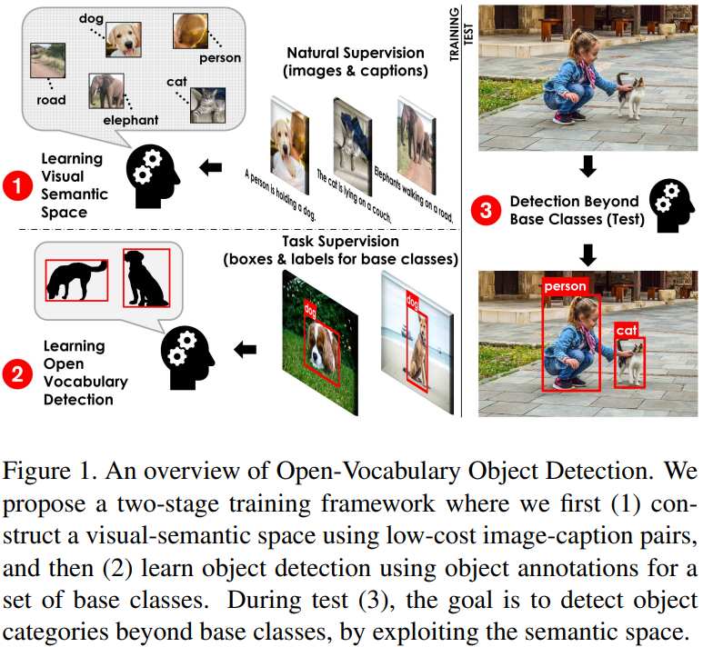

# Daily Paper Reading Log

## Table of Contents

- [2022](#2022)
    - [2022/05](#202205)   

## 2022
### 2022/05

- **2022/05/21, Saturday.**

    x.<u> Learning to Prompt for Open-Vocabulary Object Detection withVision-Language Model. CVPR 2022.</u> Zareian, Alireza, et al. U Columbia. [[PDF]](https://arxiv.org/pdf/2203.14940.pdf) [[Code]](https://github.com/dyabel/detpro)
    - Main Idea: Pre-train the visual backbone with image-text pairs which is easy to access from web to learn the visual semantics about diverse classes(include classes which do not have box annotation). 
    
  

    x.<u> Declaration-based Prompt Tuning for Visual Question Answering. IJCAI 2022.</u> Liu, Yuhang, et al. Huazhong U. [[PDF]](https://arxiv.org/pdf/2205.02456.pdf) [[Code]](https://github.com/CCIIPLab/DPT)
    - Main Idea:
    - Take away message:
    
  

    x.<u> Spatiality-guided Transformer for 3D Dense Captioning on Point Clouds. IJCAI 2022.</u> Wang, Heng, et al. U Sydney. [[PDF]](https://arxiv.org/pdf/2204.10688.pdf) [[Code]](https://github.com/heng-hw/SpaCap3D)
    - Main Idea:
    - Take away message:
    
  

Pending...

